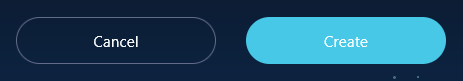

<div align="center">

<picture>

</picture>
<br />
<br />
  
Ladies and gentlemen, Reactronauts, and esteemed coding enthusiasts, welcome aboard the <b>USS React</b>! As we prepare for our journey through our Solar System, please ensure your seat belts are fastened and your laptops securely stowed in front of you. This flight is under your skillful command, because <b>you’ve been chosen to be the pilot on this mission</b>. On behalf of the crew, we wish you smooth coding!

</div>

---

## Prerequisites

Node **16+** and `yarn`.

## Rules

1. The choice of libraries is free (except for UI, see rule #2).
2. No UI library should be used, predefined styles are already available.
3. Data must remain synchronized throughout the application, without page reloading.
4. At the end of the exercise, there should be **no errors** in the console. 😋

## Development

[Clone the project](https://docs.github.com/en/repositories/creating-and-managing-repositories/cloning-a-repository) then run the commands :

```shell
yarn install # Install the dependencies
yarn dev # Run the development server
```
The React application launches on `localhost:5173` and the API server on `localhost:3004`.

> [!NOTE]
> To change the server configurations, refer to the documentation for [Vite](https://vitejs.dev/config/server-options.html) and [JSON Server](https://github.com/typicode/json-server).

## API

A REST API is available to retrieve the data required for the application. It can be accessed through the URL `localhost:3004`.

Two entry points are available: `planets` and `sun`. The routes we will be using are as follows:

```
GET     /planets
GET     /planets/:id
GET     /sun
POST    /planets
DELETE  /planets/:id
```

To add some realism, a response delay of **500ms** is configured by default for each request to the API.

> [!NOTE]
> For more information, refer to the [JSON Server](https://github.com/typicode/json-server) documentation.

#### Data formats

```js
planets: [
  {
    id: string,
    name: string,
    image: string,
    description: string,
    characteristics: {
      diameter: string,
      population: string,
      type: string
    }
  }
]
```

```js
sun: {
  name: string,
  description: string,
  images: {
    default: string,
    ultraviolet: string
  }
}
```

## UI Components

The interface components required for the exercise are available in the folder `src/components`:

| Component | Description |
| --- | --- |
| [`<Spinner>`](src/components/Spinner.jsx) | Displays a loader indicator |
| [`<Image>`](src/components/Image.jsx) | Displays an image |
| [`<Icon>`](src/components/Icon.jsx) | Displays an icon |
| [`<Button>`](src/components/Button.jsx) |  Displays a button |
| [`<ToggleSwitch>`](src/components/ToggleSwitch.jsx) | Displays an enable/disable button |

The documentation for each component is available in the [JSDoc](https://jsdoc.app/) of their respective file.

## Instructions

🚀 *Time for take-off...*

1. [The solar system](#1-the-solar-system-)
2. [A planet](#2-a-planet-)
3. [Navigation](#3-navigation-)
4. [The sun](#4-the-sun-%EF%B8%8F)
5. [Destroy a planet](5-destroy-a-planet-)
6. [Create a planet](#6-create-a-planet-)

### 1. The solar system 🌌

The solar system corresponds to the `<SolarSystem>` component located in the `src/pages` directory. **Your first mission is to display this component when navigating to the URL `/`.**

> 💡 As a reminder, for routing you can use the library [React Router](https://reactrouter.com/en/main).

#### Is your component visible?

Now, update the code to display a list of planets in our system:

1. Retrieve planet data by making an API call
2. Display the list of planets following the template below

In HTML, a list is usually structured using the semantic `<ul>` and `<li>` tags. To ensure the interface displays correctly, please use this template:

```html
<ul>
  <li>
    <a>
      
      <span><!-- Planet name n°1 --></span>
    </a>
  </li>
  <li>
    <a>
      
      <span><!-- Planet name n°2 --></span>
    </a>
  </li>
  [...]
</ul>
```

Of course, you'll need to translate this code while keeping *React* in mind: use the available components and remember that you should be able to display an indeterminate number of planets.

> A little tip: it generally looks nicer if you display a loading indicator while the data are loading. 😉

### 2. A planet 🪐

Now that the solar system is in place, it's time to create pages for the planets. The corresponding component is `<Planet>`, and it should be displayed when navigating to the URL `/planets/:id`.

1. Add the route to access a planet's page
2. Retrieve the data of the planet corresponding to the `id` parameter in the URL
3. Update the `<Planet>` component to display the data.
4. Update `<SolarSystem>` so that when clicking on a planet, you are redirected to its page (**Note:** There should be no page reloading!)

The template for a planet's page is as follows:

```html
<h1><!-- Name --></h1>


<p>
  <!-- Description -->
</p>

<ul>
  <li>
    <h6>Type</h6>
    <!-- Type -->
  </li>
  <li>
    <h6>Population</h6>
    <!-- Population -->
  </li>
  <li>
    <h6>Diameter</h6>
    <!-- Diameter -->
  </li>
</ul>
```

### 3. Navigation 🧭

**Congratulations, we now have a solar system and planets!** Let's try navigating around in the midst of all this.

In the `src/components` directory, you'll find the `<Navigation>` component. The navigation should be accessible from **all pages of the application** and allow navigating between them.

1. Add navigation to the application
2. Display a list of clickable links to navigate between the planets
3. Update the navigation element containing the rocket icon (the first one), so that clicking on it redirects you to the solar system

> ⭐ **Bonus:** an active link should be displayed in blue, **without modifying** the styles.

The template for a navigation item is as follows:

```html
<li>
  <a>
    <!-- Name of the planet -->
  </a>
</li>
```

### 4. The sun ☀️

Let's add some light to our system. The `<Sun>` component is here for that, and it should be accessible via the URL `/sun`.

1. Add the route to access the sun's page
2. Retrieve the data of the sun
3. Update the `<Sun>` component to display the data
4. Update `<SolarSystem>` to add the sun as the first element in the list

The template for the sun's page is as follows:

```html
<h1><!-- Name --></h1>


<p>
  <!-- Description -->
</p>
```

#### Is it too easy?

Very well, since we don't do things halfway here, you need to ensure that we can change the image of the sun to switch from the `default` view to the `ultraviolet` view (and vice versa).

Below the `<p>` of the description, add an enable/disable button to switch between the two views:


Now, develop the functionality to change the sun's image when clicking on this button. **No API call is necessary.**

---

<div align="center">
<strong>Congratulations, the mission is a success! We now have a complete solar system with its sun and planets.</strong><br />
But what if we took it even further...
</div>

---

### 5. Destroy a planet 💥

Now that the data are displayed, let's try manipulating them a bit. On the `<Planet>` component, add a button below the list of characteristics:


#### Your objectives:

1. Add the code to delete a planet when the button is clicked
2. Redirect the user to the solar system when the deletion is successful

> [!WARNING]
> The CRUD actions will directly modify the `db.json` file. A backup of the initial data is available in the `db_backup.json` file.

### 6. Create a planet 🌱

**Great!** Now that you've destroyed all the planets in the system, it would be nice to be able to create new ones.

You have a `<CreatePlanetForm>` component at your disposal, containing a simple form template. To start, you need to make sure that the form can be accessed from the URL `/planets/create`:

1. Create the route to access the form
2. On the `<SolarSystem>` component, add the following button at the end of the list of planets:

```html
<li id="newPlanet">
  <a>
    <div id="create">
      <span>
        <Icon name="plus" />
      </span>
    </div>

    <span>New planet</span>
  </a>
</li>
```

3. Add the code to access the creation form when the button is clicked

Perfect, now that the form is accessible, let's make it functional. The expected data format for creating a planet is as follows:

```js
{
  name: string,
  image: string,
  description: string,
  characteristics: {
    diameter: string,
    population: string,
    type: string
  }
}
```

Except for the `image` field, all these values can be retrieved through the `<input>` and `<textarea>` elements in the form. There are several ways to achieve this, so feel free to choose the method that suits you.

#### And what about the image?

The list of available images can be retrieved from the `src/config/images.js` file. The user should be able to select an image of their choice from the items in this list.

Below the form title, add the list of images using the following template:

```html
<ul>
  <li class="selected">
    
  </li>
  <li>
    
  </li>
  [...]
</ul>
```

The CSS class `selected` should be applied **only to the selected image**. As a reminder, the template above is written in HTML, you need to translate it into React.

> ⭐ **Bonus:** two images of the Sun have also found their way into this list. Try removing them from the images offered to the user **without modifying** the `images.js` file.

#### It's lacking a bit of action...

It's all well and good to have a form, but you should be able to interact with it! Add the following action buttons in the corresponding section:



#### The final challenge:

1. Send the form data to the database when clicking the "Create" button
2. Redirect the user to the page of the new planet upon successful creation
3. Redirect to the solar system when clicking the "Cancel" button

---

<div align="center">
<h4>Mission accomplished, Reactronaut! You have successfully completed this reactial adventure. <br />Now, relax and enjoy the breathtaking view of the universe you've created. 🌟<h4>
</div>